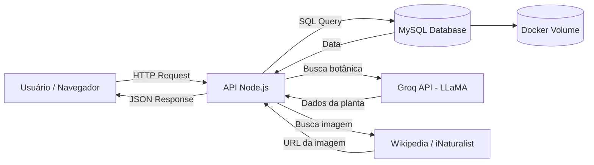
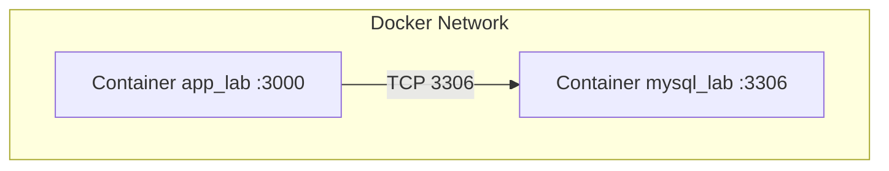
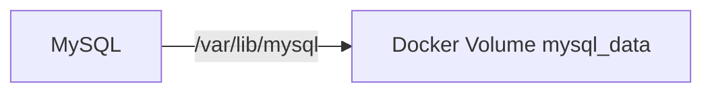
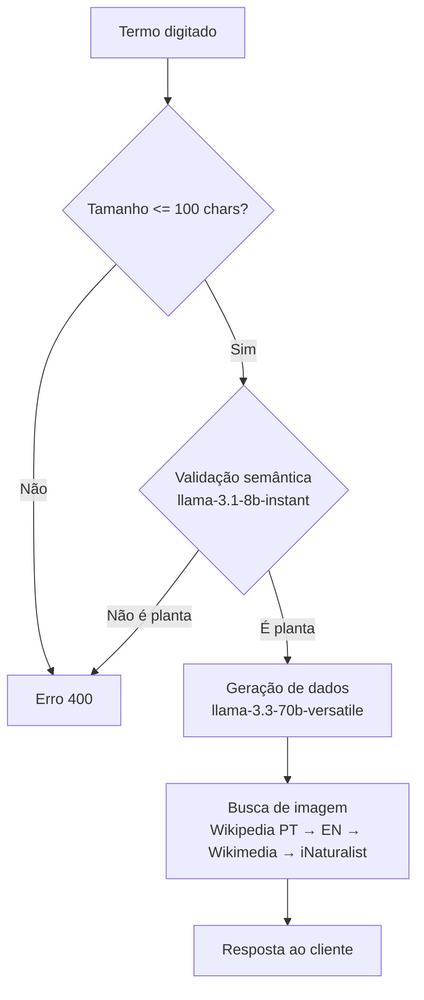
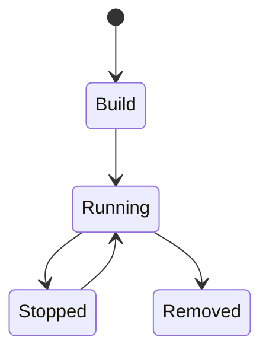

# 🌿 Catálogo de Plantas — MySQL + Docker + Node.js + IA

> Aplicação web full-stack para pesquisa e catalogação de plantas, com informações geradas por Inteligência Artificial, autenticação de usuários e sistema de favoritos.

---

## 📌 Visão Geral

Este projeto demonstra como:

* Subir um **MySQL** com Docker Compose com persistência de dados
* Integrar com uma **API Node.js** seguindo boas práticas de segurança
* Autenticar usuários com **sessão**, **bcrypt** e **rate limiting**
* Consultar uma **IA (Groq/LLaMA)** para gerar informações botânicas
* Buscar imagens reais de plantas com fallback em cascata por múltiplas fontes
* Implementar acessibilidade para leitores de tela (ARIA)

---

### 📊 Visão de alto nível



---

### 🔗 Comunicação entre containers



---

### 💾 Persistência de dados



---

## 📦 Estrutura do Projeto

```bash
lab-mysql-docker/
├── docker-compose.yml
├── db/
│   └── init.sql
+---app
|   |   .dockerignore
|   |   .env
|   |   .env.example
|   |   db.js
|   |   Dockerfile
|   |   package-lock.json
|   |   package.json
|   |   server.js
|   |   
|   +---controllers
|   |       usuariosController.js
|   |       
|   +---middlewares
|   |       auth.js
|   |       
|   |   +---cookie
|   |   |       index.js
|   |   |       LICENSE
|   |   |       package.json
|   |   |       README.md
|   |   |       SECURITY.md
|   |   |       
|   |   |       
|   |   +---mysql2
|   |   |   |   index.d.ts
|   |   |   |   index.js
|   |   |   |   License
|   |   |   |   package.json
|   |   |   |   promise.d.ts
|   |   |   |   promise.js
|   |   |   |   README.md
|   |   |   |   
|   |   |   +---lib
|   |   |   |   |   auth_41.js
|   |   |   |   |   compressed_protocol.js
|   |   |   |   |   connection.js
|   |   |   |   |   connection_config.js
|   |   |   |   |   create_connection.js
|   |   |   |   |   create_pool.js
|   |   |   |   |   create_pool_cluster.js
|   |   |   |   |   helpers.js
|   |   |   |   |   packet_parser.js
|   |   |   |   |   pool.js
|   |   |   |   |   pool_cluster.js
|   |   |   |   |   pool_config.js
|   |   |   |   |   pool_connection.js
|   |   |   |   |   results_stream.js
|   |   |   |   |   server.js
|   |   |   |   |   tracing.js
|   |   |   |   |   
|   |   |   |   +---auth_plugins
|   |   |   |   |       caching_sha2_password.js
|   |   |   |   |       caching_sha2_password.md
|   |   |   |   |       index.js
|   |   |   |   |       mysql_clear_password.js
|   |   |   |   |       mysql_native_password.js
|   |   |   |   |       sha256_password.js
|   |   |   |   |       
|   |   |   |   +---base
|   |   |   |   |       connection.js
|   |   |   |   |       pool.js
|   |   |   |   |       
|   |   |   |   +---commands
|   |   |   |   |       auth_switch.js
|   |   |   |   |       binlog_dump.js
|   |   |   |   |       change_user.js
|   |   |   |   |       client_handshake.js
|   |   |   |   |       close_statement.js
|   |   |   |   |       command.js
|   |   |   |   |       execute.js
|   |   |   |   |       index.js
|   |   |   |   |       ping.js
|   |   |   |   |       prepare.js
|   |   |   |   |       query.js
|   |   |   |   |       quit.js
|   |   |   |   |       register_slave.js
|   |   |   |   |       reset_connection.js
|   |   |   |   |       server_handshake.js
|   |   |   |   |       
|   |           
|   +---routes
|   |       favoritos.js
|   |       plantas.js
|   |       usuarios.js
|   |       
|   \---services
|           usuariosService.js
|           
+---db
|       init.sql
|       
+---frontend
|   |   app.js
|   |   busca.css
|   |   busca.html
|   |   busca.js
|   |   cookies.js
|   |   index.html
|   |   login.html
|   |   login.js
|   |   perfil.html
|   |   perfil.js
|   |   styles.css
|   |   
|   \---imagens
|           icone_perfil.png
|           icone_site.png
|           
\---nginx
        default.conf
        

```

---

## ⚙️ Stack Tecnológica

| Camada         | Tecnologia                        |
| -------------- | --------------------------------- |
| Container      | Docker                            |
| Orquestração   | Docker Compose                    |
| Banco de Dados | MySQL 8                           |
| Backend        | Node.js + Express                 |
| Driver DB      | mysql2                            |
| Autenticação   | express-session + MySQLStore      |
| Segurança      | bcryptjs + helmet + express-rate-limit |
| IA             | Groq SDK (LLaMA 3.3 70B)         |
| Imagens        | Wikipedia PT/EN + Wikimedia Commons + iNaturalist |
| Frontend       | HTML + CSS + JavaScript puro      |

---

## 🚀 Quick Start

### 1. Clonar o projeto

```bash
git clone <repo-url>
cd lab-mysql-docker
```

### 2. Configurar variáveis de ambiente

```bash
cp app/.env.example app/.env
# Edite app/.env com suas credenciais e chave da API Groq
```

### 3. Subir o ambiente

```bash
docker-compose up -d
```

### 4. Verificar containers

```bash
docker ps
```

### 5. Acessar a aplicação

```
http://localhost:3000
```

---

## 🧠 Inicialização do Banco

O arquivo `db/init.sql` é executado automaticamente na primeira criação do container, criando as três tabelas do sistema:

```sql
CREATE TABLE IF NOT EXISTS usuarios ( ... );
CREATE TABLE IF NOT EXISTS sessions ( ... );
CREATE TABLE IF NOT EXISTS favoritos ( ... );
```

---

## 🔌 Conexão com Banco

Configurada via variáveis de ambiente no `.env`:

| Parâmetro | Variável          |
| --------- | ----------------- |
| Host      | DB_HOST           |
| Porta     | 3306              |
| Database  | DB_NAME           |
| User      | DB_USER           |
| Password  | DB_PASSWORD       |

---

## 🌐 Endpoints da API

### Autenticação
| Método | Rota              | Descrição                          |
| ------ | ----------------- | ---------------------------------- |
| POST   | /api/auth/login   | Login com email e senha            |
| POST   | /api/auth/logout  | Logout com destruição de sessão    |
| GET    | /api/auth/me      | Retorna dados do usuário logado    |

### Usuários
| Método | Rota                  | Descrição              |
| ------ | --------------------- | ---------------------- |
| POST   | /api/usuarios         | Cadastro de novo usuário |
| GET    | /api/usuarios         | Lista usuários          |
| GET    | /api/usuarios/:id     | Busca usuário por ID    |
| PUT    | /api/usuarios/:id     | Atualiza usuário        |
| DELETE | /api/usuarios/:id     | Remove usuário          |

### Plantas
| Método | Rota          | Descrição                                      |
| ------ | ------------- | ---------------------------------------------- |
| GET    | /api/plantas  | Busca planta por IA com validação semântica    |

### Favoritos
| Método | Rota                  | Descrição                          |
| ------ | --------------------- | ---------------------------------- |
| GET    | /api/favoritos        | Lista favoritos do usuário logado  |
| POST   | /api/favoritos/toggle | Adiciona ou remove favorito        |

---

## 🔐 Segurança

* **Senhas** com hash bcrypt (12 salt rounds) — nunca armazenadas em texto puro
* **Sessões** persistidas no MySQL com expiração automática
* **Rate limiting** no login (5 tentativas / 15 min) e na busca de IA (20 buscas / 15 min)
* **Validação de input** — tamanho máximo de 100 caracteres no termo de busca
* **Validação semântica** — modelo leve verifica se o termo é uma planta antes de acionar o modelo principal
* **Helmet** configurado para headers de segurança HTTP
* **Credenciais** externalizadas em `.env`, nunca no código

---

## 🌿 Busca por IA

O fluxo de busca segue três etapas antes de retornar os resultados:



---

## ♿ Acessibilidade

* Estrutura semântica com `role`, `aria-labelledby`, `aria-live`
* Botões com `aria-label` e `aria-pressed` dinâmicos
* Campos de formulário com `aria-describedby` e textos auxiliares
* Imagens com `alt` descritivo (nome popular + nome científico)
* Texto oculto `.sr-only` para elementos puramente visuais
* Feedback de ações via `aria-live` em vez de `alert()`
* Compatível com leitores de tela (NVDA, Screen Reader)

---

## 🔄 Ciclo de Vida dos Containers



---

## 🧹 Reset do Ambiente

```bash
docker-compose down -v
```

⚠️ Remove todos os containers e dados do volume

---

## 🧪 Testes Manuais

### Acessar MySQL via terminal:

```bash
docker exec -it mysql_lab mysql -u user -p
```

### Ver logs da aplicação:

```bash
docker logs app_lab --tail 100
```

---

## 🧠 Conceitos Demonstrados

* Containerização de banco de dados com Docker
* Rede interna entre containers
* Persistência com volumes nomeados
* Inicialização automática via script SQL
* Autenticação stateful com sessão persistida em banco
* Hash de senhas com bcrypt
* Rate limiting e proteção contra abuso de API
* Integração com IA generativa (Groq/LLaMA)
* Busca de imagens com fallback em cascata
* Validação semântica de input via IA leve
* Acessibilidade web (WCAG / ARIA)

---

## 🔧 Ferramentas Recomendadas

* DBeaver ou MySQL Workbench (interface gráfica para o banco)
* VS Code
* Postman / Insomnia (testes de API)
* NVDA (leitor de tela para testar acessibilidade)
* Docker Desktop

---

## 📚 Referências

* https://docs.docker.com/
* https://hub.docker.com/_/mysql
* https://dev.mysql.com/doc/
* https://expressjs.com/
* https://console.groq.com/docs/
* https://www.w3.org/WAI/ARIA/apg/
* https://www.w3schools.com/sql/

---

## 📄 Licença

Este projeto é destinado a fins educacionais.

---